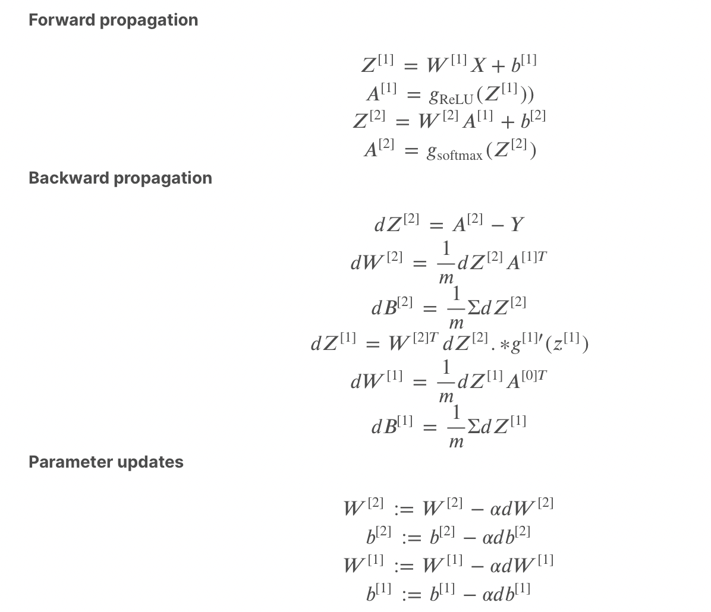

# Part 1: K-Nearest Neighbors Classification

## How you formulated the problem:

For implementeing the K Nearest neightbour Classification the main difference lies in assigning the weights for the given datas. Wherein we have uniform data and distance data which are not uniform as in the weights are assignd in such a way that : Weights are inverely proportional to the distance.
                          
Here in the case of the uniform data the maximum count number of same class for the provided K is taken into consideration for prediction but in the case of distance data a weight is provied to each class of data. 
List of these vales for the respective "uniform" or "distance" are the predicted target

## Brief description of how your program works:

The index of the list is enumerated out and its spliced according to the K provided. The prediction list is obtained with respect to the uniform and distance data. The weights are calcuated accordingly. If its a distance data which is not uniform then to find the nearest neighbour weights are multiplied with it. The Weights are inverely proportional to the distance. Then the max of the list is taken into consideration as the nearest neighbour.

Two distances are calculated here one neing manhatten and other one being eucliden distance.  

## Discussion of any problems you faced and any assumptions, simplifications, and/or design decisions you made:

For the distance data the count dictionary is impleted and using lambda function the max maximum weighted count is obtained. Each time parsing and adding for each point is highly computational.

# Part 2: Multilayer Perceptron Classification

## How you formulated the problem:

3 stages are implemented:

Feed forward neural propagation where the weighted sum of the input is calculated along with the bias.
Then the back propagation is calculated using the below formulas.
Then the parameters are updated using gradient gradient.

## Brief description of how your program works:

4 activation functions are implemented in the util file. 
Identity, Sigmoid, tanh and relu. These non linear transformation are used to calculate the weighted sum of the input.
One hot encoding is also calculated for the provided labels.
The below equations are used to compute the feedforward, backward and the gradient descent:

## Discussion of any problems you faced and any assumptions, simplifications, and/or design decisions you made:

Firstly implemented Matrix multiplication by taking the transpose of the input matrix but then it computationally started taking more time.

